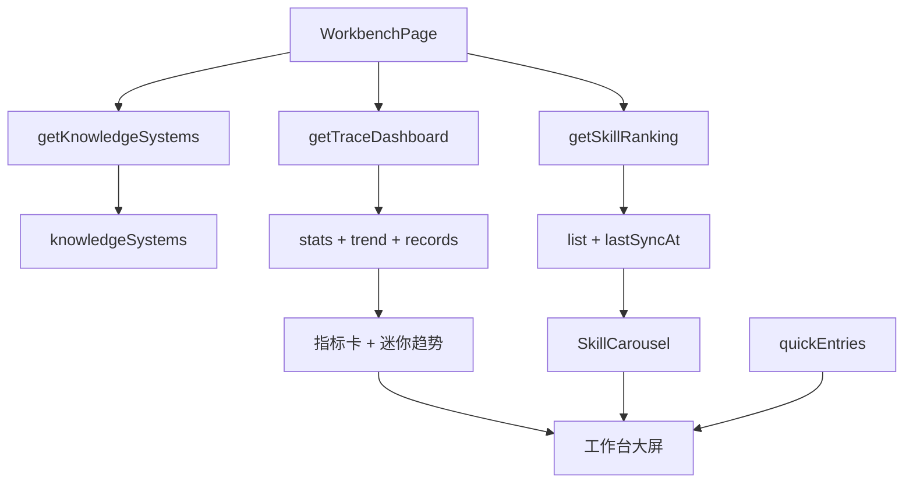

# 工作台数字大屏与整体 UI 优化计划

## 一、工作台数字大屏设计

### 1.1 视觉风格（与当前设计统一）

- **主色与背景**：延续 [theme.ts](src/styles/theme.ts) 的 `colorPrimary: "#1677ff"`、`colorBgLayout: "#f4f7fb"`；大屏区域采用浅色背景 + 蓝色系强调，不改为深色全屏，以保持与侧栏、顶栏一致。
- **科技感手段**：玻璃态卡片（半透明 + 描边）、指标数字大号字重与等宽数字、Recharts 迷你趋势图、适度阴影与圆角（与现有 `zy-card-hover` 统一）。
- **布局**：顶部为指标聚合区（多块统计卡），中部为 Skill 能力轮播，底部为快捷入口与可选「最近执行」摘要。

### 1.2 指标聚合

- **数据来源**：  
  - 知识库数量：`useAppSelector(state => state.domain.knowledgeSystems.length)` 或请求 `getKnowledgeSystems()`。  
  - Skill 总数 / 榜单摘要：`domainApi.getSkillRanking({})` 取 `list.length` 与 `lastSyncAt`。  
  - 问数/执行指标：`domainApi.getTraceDashboard({})` 取 `stats`（成功率、平均耗时、总耗时）及 `records.length` 作为「查询次数」。
- **实现**：在 [WorkbenchPage.tsx](src/pages/domain/workbench/WorkbenchPage.tsx) 内 `useEffect` 并行请求上述接口（或新增 `getWorkbenchSummary()` 聚合接口），落库到本地 state，供指标卡与轮播使用。
- **展示**：4–6 个指标卡（如：知识库数、Skill 总数、今日/总问数请求、成功率、平均耗时），部分卡片内嵌 Recharts 迷你折线（如执行耗时趋势，使用现有 `traceTrend` 数据）。

### 1.3 Skill 能力轮播模块

- **数据**：使用 `getSkillRanking({})` 返回的 `list`，取前 6–8 条（或一页 3 条 × 多页）。
- **组件**：使用 Ant Design [Carousel](https://ant.design/components/carousel) 组件，`autoplay` 开启，`effect="fade"` 或 `scrollx` 按设计选择。
- **每页内容**：每页展示 2–3 个 Skill 卡片；单卡展示：名称、简介（summary）、安装量（installsText）、分类/标签；卡片可点击跳转 `/domain/skills` 或触发打开 Skill 详情弹窗（需传入 `getSkillById` 与 Modal 状态，或仅跳转榜单页）。
- **样式**：卡片与 [global.css](src/styles/global.css) 中 `.zy-card-hover` 风格一致，轮播容器加圆角与内边距，与指标区、快捷入口间距统一。
- **文件**：新建 `src/components/domain/workbench/SkillCarousel.tsx`，接收 `skills: SkillItem[]` 与可选 `onSkillClick?: (id: string) => void`；[WorkbenchPage.tsx](src/pages/domain/workbench/WorkbenchPage.tsx) 请求 Skill 列表并渲染 `<SkillCarousel />`。

---

## 二、工作台其余功能模块规划

- **指标区（上）**：如上，4–6 块统计卡 + 可选迷你趋势图。  
- **Skill 轮播（中）**：如上，重点展示 Skill 能力。  
- **快捷入口（下）**：保留现有 [WorkbenchPage](src/pages/domain/workbench/WorkbenchPage.tsx) 的 `quickEntries`，改为更突出图标 + 标题 + 简短描述的入口卡，与数字大屏风格统一（同一 Card 风格、间距）。  
- **可选**：「最近执行」区块——调用 `getTraceDashboard({})` 取 `records` 前 5 条，列表展示问题描述、状态、耗时，点击「查看全部」跳转 `/domain/operation-logs`。若篇幅紧张可仅保留指标 + 轮播 + 快捷入口。

---

## 三、整体系统 UI 与不适配项优化

### 3.1 统一规范

- **空状态**：所有使用 Table 的页面统一 `locale={{ emptyText: "xxx" }}`；使用 `Empty` 或 `EmptyState` 的页面统一描述文案风格（如「暂无 xxx，请…」）。  
- **卡片**：全局继续使用 `.zy-card-hover`，确保新组件（如工作台指标卡、Skill 轮播卡）也复用该类；卡片内边距与 [theme Card.bodyPadding](src/styles/theme.ts) 一致（16）。  
- **间距与圆角**：页面内区块间距 12/16/24 与 theme `borderRadius: 8` 一致；表格、表单与现有页面对齐。

### 3.2 逐模块检查与修正

- **语义知识库**：列表页、管理页各 Tab 内表格/树/卡片空态、按钮禁用态（如无选中节点时「编辑」「删除」）、加载态已具备的保留，缺失的补全。  
- **业务术语词典**：列表 Table 的 emptyText、筛选重置、批量删除 Popconfirm 与反馈；编辑页「关联的指标/维度」区块在无数据时的展示。  
- **示例问题库**：Table emptyText、执行弹窗的加载与结果空态。  
- **操作日志**：筛选、导出、表格 emptyText、统计卡与趋势图数据为空时的展示。  
- **Skill 榜单**：榜单列表空态、手动同步 loading、详情/编辑弹窗 loading 已存在，确认无遗漏。  
- **经营指标问数**：结果区空态、图表无数据时的占位。  
- **工作台**：本次新增的指标卡、轮播、快捷入口在数据为空或请求失败时的占位与错误提示。

### 3.3 响应式与可访问性

- 工作台大屏：小屏下指标卡单列、轮播单卡/单列、快捷入口单列，与现有 Row/Col 的 `xs={24} md={8}` 模式一致。  
- 按钮与链接：确保禁用态有 `disabled` 与样式，危险操作有 Popconfirm；重要操作有 loading 或 success/error 反馈。

---

## 四、数据流与接口

- 不在 mockApi 中新增聚合接口也可：工作台内并行调用 `getKnowledgeSystems()`、`getSkillRanking({})`、`getTraceDashboard({})`，在组件内汇总展示。若希望减少请求，可新增 `getWorkbenchSummary()` 在 mockApi 内一次读取 `loadDomainData()` 并返回 `{ knowledgeSystemCount, skillCount, lastSkillSyncAt, traceStats, traceTrend, recentTraceRecords }`。

---

## 五、关键文件清单

| 类别       | 文件                                                                                                                                          |
| -------- | ------------------------------------------------------------------------------------------------------------------------------------------- |
| 工作台大屏与轮播 | [WorkbenchPage.tsx](src/pages/domain/workbench/WorkbenchPage.tsx)、新建 [SkillCarousel.tsx](src/components/domain/workbench/SkillCarousel.tsx) |
| 样式       | [global.css](src/styles/global.css)（工作台大屏、轮播容器类名）                                                                                           |
| 数据       | [mockApi.ts](src/services/mockApi.ts)（可选 getWorkbenchSummary）                                                                               |
| UI 走查与修正 | 各列表/表格页、EmptyState、Table locale、Popconfirm、按钮 loading/disabled                                                                              |

---

## 六、实施顺序建议

1. **工作台数据与指标区**：WorkbenchPage 请求聚合数据，渲染指标卡与迷你趋势图（Recharts），并统一空态/错误态。
2. **Skill 轮播**：实现 SkillCarousel 组件并接入 WorkbenchPage，样式与现有卡片统一。
3. **快捷入口与可选「最近执行」**：美化快捷入口，按需增加最近执行区块。
4. **全系统 UI 走查**：按 3.2 逐模块补全空态、禁用态、加载态与反馈。
5. **响应式与验收**：小屏下工作台与各页布局检查，`npm run build` 与 `npm run lint` 通过。

---

## 七、验收标准

- 工作台具备科技感数字大屏效果，指标来源于知识库、Skill、操作日志，数据正确聚合展示。  
- Skill 能力轮播模块展示榜单前若干条，自动轮播，样式与当前设计风格一致，交互（点击跳转或打开详情）明确。  
- 快捷入口保留且视觉与工作台统一。  
- 全系统表格/列表空态、关键按钮的禁用与加载态、危险操作确认与反馈无遗漏。  
- 构建与 lint 通过，无新增控制台报错。

